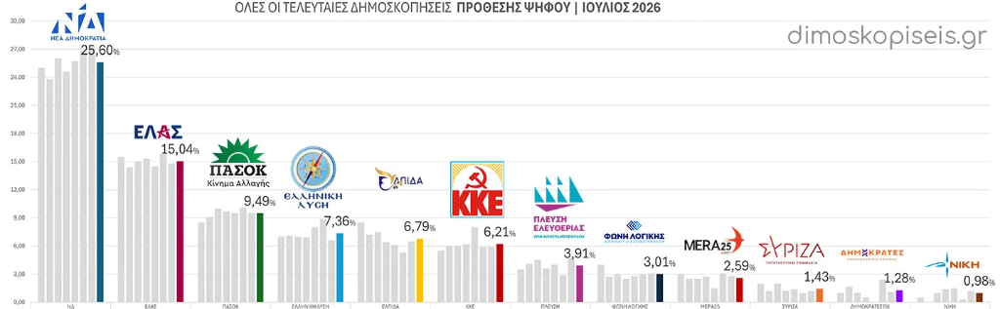
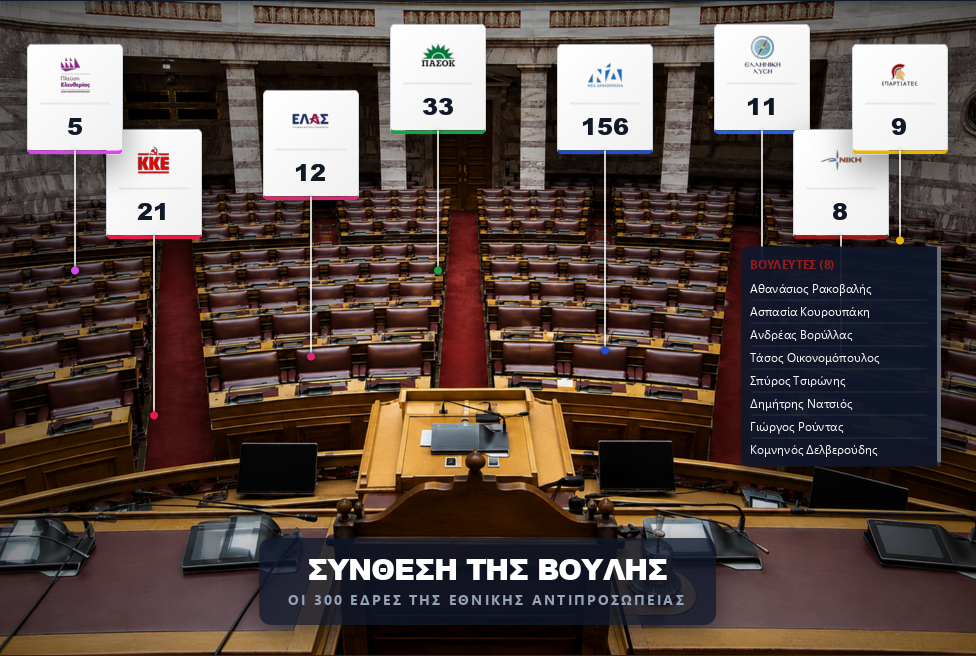
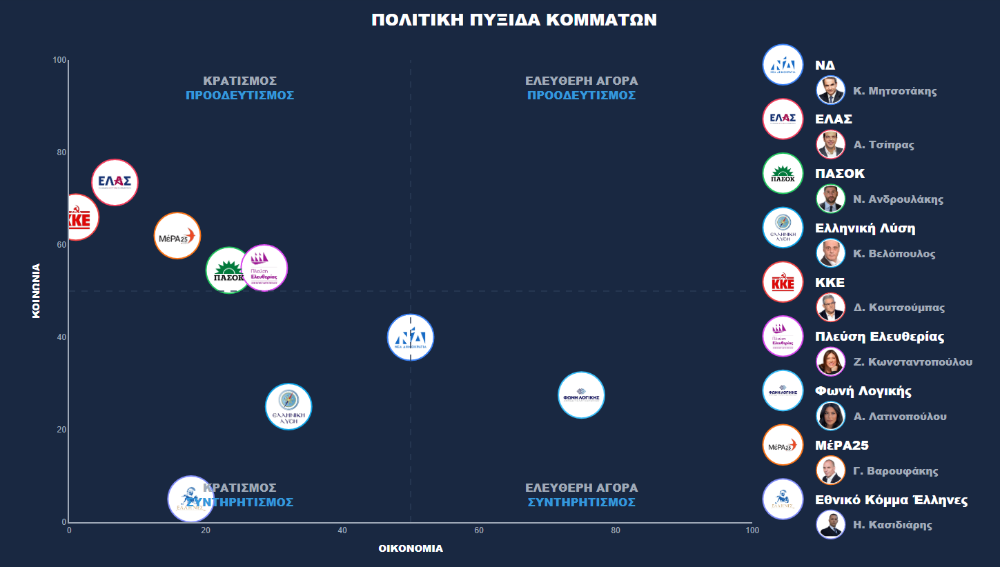
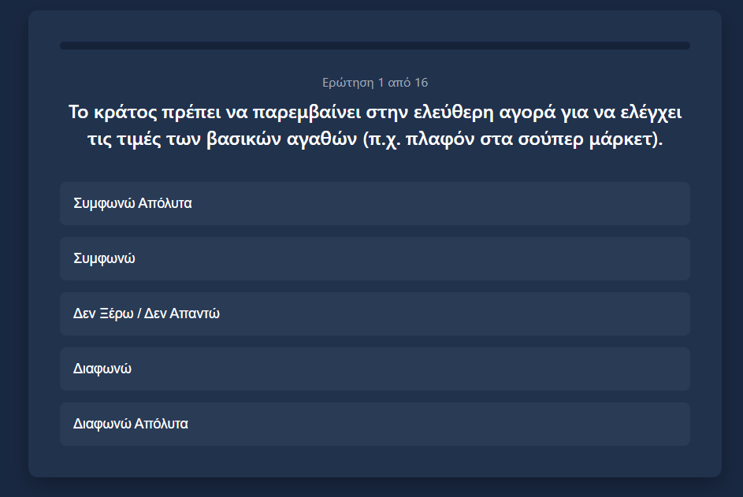
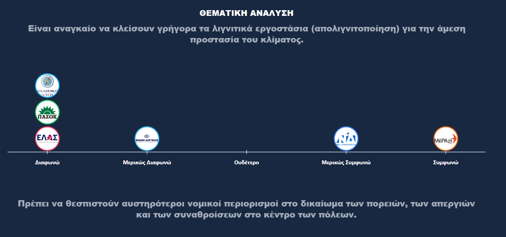
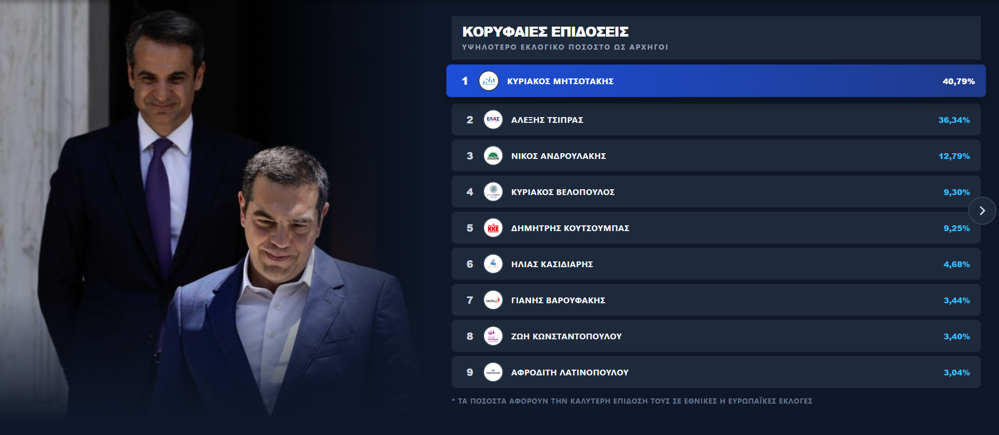
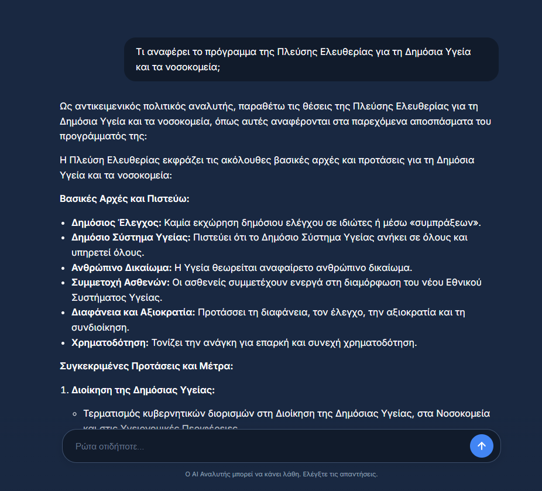

# Election RAG & Parliament Analytics 🏛️


An advanced web application providing deep political analytics, data visualization, and an interactive AI Analyst powered by a custom Retrieval-Augmented Generation (RAG) system for the Hellenic Parliament.

---

## 🛠️ Tech Stack

- **Backend:** FastAPI, Python 3.12
- **AI & Vector DB:** Google Gemini 2.5 Flash, ChromaDB, SentenceTransformers (`all-MiniLM-L6-v2`)
- **Data & Processing:** scikit-learn (PCA), Pandas
- **Frontend:** Vanilla HTML/CSS/JS, Plotly.js (Data Visualization)

---

# Architecture & Mechanics

## Methodology: Party Selection (Polling Criteria)
The inclusion of political formations in this platform was strictly based on current polling data (July 2026) and realistic political projections:


* **Excluded (< 3% Threshold):** Formations such as **SYRIZA**, **Dimokrates**, and **Niki** were deliberately excluded from the dataset. According to recent polls, they fail to pass the 3% electoral threshold required to enter the parliament. Furthermore, there are no political indicators suggesting their percentages will rise; on the contrary, current trends indicate a continuous decline.
* **Excluded (Structural Instability):** The party **Elpida** was excluded. This decision was based on their "equidistant" and highly ambiguous proposals, combined with strong political indicators suggesting the formation will likely dissolve before the upcoming elections.
* **Included (Conditional Momentum):** The party **Ellhnes (H. Kasidiaris)** was added to the platform. Although its founder is currently imprisoned, there is a realistic probability of his release before the elections. Given their polling momentum, it is highly likely this formation will secure parliamentary representation, thus requiring their programmatic positions to be analyzed and mapped.

---

## 1. Parliament Composition
This specific section offers a dynamic, interactive visualization of the Hellenic Parliament, mapping the exact spatial distribution of political formations and their elected representatives.



The visualization is powered by a custom local database (`mps.js`), which contains the complete registry of all 300 elected MPs, strictly structured by parliamentary group.

For the dynamic linking of each MP with their biographical article, we utilized Wikipedia's strict URL naming convention (slug routing). Our routine accepts the full name as input, applies string manipulation by converting spaces to underscores (`_`), and appends it to the base URI (`https://el.wikipedia.org/wiki/`).

**Known Limitation**: The dataset reflects the initial parliamentary composition (Day 1 snapshot). Subsequent independent declarations are not integrated into the current branch. This constitutes a deliberate design choice (design constraint), as the algorithm (RAG & Scoring) exclusively analyzes collective party manifestos (electoral mandate) and not the individual trajectories of MPs.

---

## 2. Political Compass
This specific section visualizes the ideological positioning of political formations on a two-dimensional map, translating hundreds of pages of data into precise mathematical coordinates.



**Data Aggregation Pipelines:** 
The evaluation was fed by a solid dataset, which was extracted through three (3) different methods:
* **Parliamentary Roll-Call Votes (Vouliwatch):** Extraction of the actual voting history on critical bills, so that the system's evaluation is based on legislative acts and not exclusively on electoral promises.
* **Official Manifestos (Manifesto Project Database - MARPOR):** Integration of the official texts of principles and positions of the parties. The data extraction was done from the academic MARPOR database, ensuring high reliability and a ready, research-certified structure in the electoral texts.
* **Custom Web Scraping:** For formations that lacked open structured data, special Python scripts were developed which scraped their positions directly from their official websites.

**Evaluation Architecture:** 
The engine evaluates the parties on 14 Political Axes (1-10 scale) via a Large Language Model (LLM). To prevent phenomena of "shallow" model understanding (e.g. misinterpreting accusatory speech), Chain-of-Thought (CoT) Prompting was applied, forcing the model to produce an intermediate reasoning path before the final output. Furthermore, to avoid "hallucinations" on axes without an official position, a strict algorithmic rule of neutrality was imposed (Default Neutral Score: 5).

**Dimensionality Reduction:** 
The final 2D visualization is a product of the Principal Component Analysis (PCA) algorithm via the scikit-learn library. The routine compresses the 14-dimensional data matrix by calculating the covariance matrix and projects the data onto the two eigenvectors with the maximum variance, generating the final axes (Economy & Society) with purely statistical criteria.

**Proxy Data Method:**
Due to the non-existence of an official manifesto and parliamentary history in newly formed formations, the "Proxy Data" method was applied. Specifically: 
* In the case of the "Spartans", historical data of "Golden Dawn" were extracted (from the period when I. Kasidiaris was a leading executive). 
* In the case of "ELAS", the recent data of "SYRIZA" were extracted (as A. Tsipras led the party until recently).

In both cases, the algorithmic assumption was integrated that the ideological line of the new parties aligns to a huge extent with the history of their natural leaders. The use of historical proxies ensured their realistic placement on the axes, bypassing the noise and potential bugs of empty data.

---

## 3. Quiz (User Matching Algorithm)
The Quiz section does not constitute a simple scoring questionnaire, but the central, interactive matching algorithm of the user's political beliefs with the ideological coordinates of the parties.



The architecture of the questionnaire (`quiz_data.js`) avoids the traditional "+1 in favor of party" approach. Instead, each of the 16 questions is dynamically mapped onto the same 14 Political Axes that were used for the AI Scoring of the parties, carrying special weights. For example, a positive vote on "Military Reinforcement" might shift the user's profile by `+1.0` on the Defense axis, but simultaneously incur a similar shift of `+0.5` on Social Conservatism. Every user response shapes and readjusts in real-time their own personal 14-dimensional vector profile.

The extraction of the final results is based on n-dimensional geometry. Upon completion of the Quiz, the client-side routine receives the user's 14-dimensional vector and compares it with the pre-calculated 14-dimensional vectors of all political formations. The comparison is implemented via the mathematical formula of Euclidean Distance, calculating the sum of the squares of the differences in each axis. The final outputs are sorted based on closest geometric proximity and normalized, displaying the exact percentage (%) of ideological matching with indisputable mathematical precision.

---

## 4. Thematic Analysis
This specific section provides a granular visualization of the political positions of each party, isolating their performance per individual thematic axis (e.g. Economy, Minority Rights, Defense).



For the visualization of this data we designed and implemented clean, one-dimensional axes (1D horizontal scatter plots) via the Plotly academic library. This UI/UX decision allows the dynamic (data-driven) and crystal-clear comparison of the placement of all parties on a specific issue, converting the raw LLM scores (1-10 scale) into a linear topology, instantly understandable by the end-user.

**Missing Data Handling**: In certain thematic axes, a deliberate absence of specific political formations is observed. This constitutes a strict design choice to ensure data integrity. Instead of assigning an arbitrary "neutral" grade (e.g. 5) to parties that do not have any official position or vote on the issue in question, their complete omission from the respective graph was chosen, thus preventing data pollution.

---

## 5. Statistics & Paradoxes (Fun Facts)
This specific section operates as a supplementary Dashboard for the statistical analysis of the parliamentary composition, displaying information that extends beyond strict political programmatic evaluation.



---

## 6. AI Analyst (RAG System)
The "Analyst" does not constitute a simple prompt wrapper around an LLM, but a complete Retrieval-Augmented Generation (RAG) system, operating as a strictly "Closed Brain". The algorithm forces the AI to answer exclusively based on our validated party data, minimizing the hallucinations that characterize traditional generative models.



The search engine is based on Vector Databases technology (ChromaDB). The entirety of the data (party texts, votes) was programmatically chunked into thousands of individual segments. Subsequently, each chunk was passed through a special Embedding Model (`all-MiniLM-L6-v2`), which transformed the text into a 384-dimensional vector. When the user submits a query, the algorithm calculates the Cosine Similarity, locating the most relevant texts within the multidimensional mathematical space, in less than 50 milliseconds.

The "understanding" of the texts (inference) and the generation of the final speech is implemented via API calls to the brand-new Google Gemini 2.5 Flash. The selection of the specific model was made by-design, as it offers the optimal trade-off between speed of response (low-latency inference) and advanced analytical capability. Furthermore, the broad context window of the 2.5 Flash, allows it to simultaneously process multiple text chunks from ChromaDB without the slightest context degradation.

**Known Limitations**: The Analyst's architecture carries two inherent limitations. 
* **API Rate Limiting:** Due to the dependence on Google's external API, the system is subject to strict call quotas. In cases of sudden high traffic (traffic spikes), a temporary denial of service may be caused (HTTP 429: Too Many Requests). 
* **RAG Dependency:** As a strictly "closed brain", the LLM is absolutely dependent on the quality of ChromaDB's search. If a poorly formulated user question leads the Cosine Similarity algorithm to retrieve "irrelevant" text chunks, the LLM does not possess an external verification mechanism, inevitably leading to the safe (but unhelpful) answer: "I did not find information in my data".

---

## 📁 Project Structure

```text
Election-Rag/
│
├── backend/                   # FastAPI server and RAG logic
│   └── main.py                # Core API endpoints & ChromaDB integration
│
├── frontend/                  # UI, visualizations and client-side logic
│   ├── index.html             # Main dashboard
│   ├── parliament.html        # Interactive parliament seating 
│   ├── political_compass.html # 2D Ideological map (PCA)
│   ├── quiz.html              # Matching algorithm interface
│   ├── ai_analyst.html        # RAG Chatbot UI
│   └── radar_charts.html      # 1D scatter thematic plots
│
├── data/                      # Raw and processed datasets
│   ├── mps.js                 # Complete MP registry & metadata
│   ├── clean/                 # Processed party manifestos (CSV)
│   └── ...                    # Scrapers & raw data
│
├── vector_db/                 # Persistent ChromaDB storage
│
├── media/                     # Images and assets for documentation
│
├── requirements.txt           # Python dependencies
├── .env.example               # Environment variables template
└── README.md                  # This documentation
```

---

## 🚀 Installation & Setup

1. **Clone the repository:**
   ```bash
   git clone https://github.com/yourusername/Election-Rag.git
   cd Election-Rag
   ```

2. **Create a virtual environment:**
   ```bash
   python -m venv venv
   # On Windows:
   venv\Scripts\activate
   # On macOS/Linux:
   source venv/bin/activate
   ```

3. **Install dependencies:**
   ```bash
   pip install -r requirements.txt
   ```

4. **Environment Variables (Optional):**
   The application will prompt you for your Google Gemini API key directly in the web UI. If you prefer to hardcode it so you don't have to enter it in the UI, you can create a `.env` file in the root directory:
   ```env
   GEMINI_API_KEY="your_api_key_here"
   ```

## 💻 Usage

### Option 1: Docker (Recommended)

The easiest way to run the application is using Docker Compose. Ensure you have [Docker Desktop](https://www.docker.com/products/docker-desktop/) installed and running.

```bash
docker-compose up -d --build
```

Then, open your web browser and navigate to:
**http://localhost:8000/static/index.html**

### Option 2: Local Python Server

If you prefer to run it locally without Docker, start the backend server using Uvicorn:

```bash
uvicorn backend.main:app --host 0.0.0.0 --port 8000 --reload
```

Then, open your web browser and navigate to:
**http://localhost:8000/static/index.html**

---

